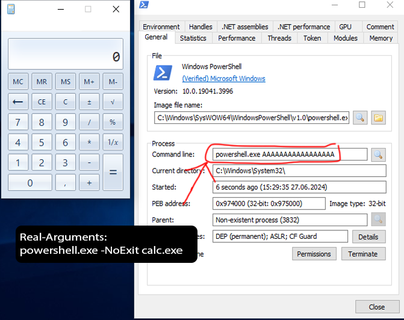

# ArgumentSpoofer


```
A code that allows you to spoofing arguments when starting a process; at the moment.
The substitution also worked on Process-Hacker - which displayed fake arguments.
```

# ✨ Code-Args:
```c
113    LPWSTR szStartupArgs = L"powershell.exe AAAAAAAAAAAAAAAAA"; // Your fake-argumnets
114    LPWSTR szRealArgs = L"powershell.exe -NoExit calc.exe"; // Your real-arguments
```

# 📒 Proof:

